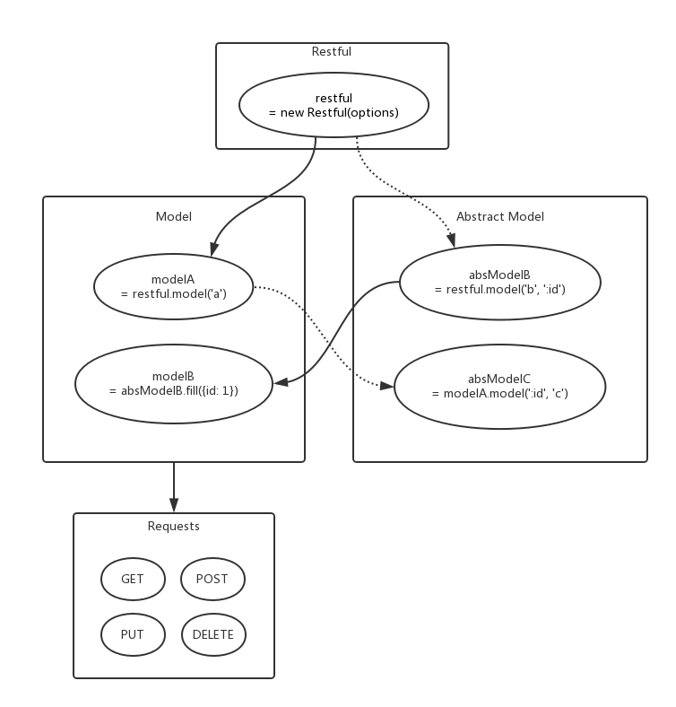

# restful-fetch


A Restful library based on [isomorphic-fetch](https://github.com/matthew-andrews/isomorphic-fetch).

## Installation

``` sh
$ npm i restful-fetch
```

## Quick start

``` js
import Restful from 'restful-fetch';

const restful = new Restful({
  presets: ['json'],
});

const Foo = restful.model('foo');
Foo.get().then(data => console.log(data));    // GET /foo

Foo.Single = Foo.model(':id');
Foo.Single.fill({id: 1}).get().then(data => console.log(data));   // GET /foo/1

Foo.Bar = Foo.Single.model('bar');
Foo.Bar.fill({id: 1}).get().then(data => console.log(data));      // GET /foo/1/bar
```

## Documents

### Overview

Everything is a model, derives from models and derives models.



### Restful

A `Restful` instance is the root model, which has a few properties to be shared
by all its derivatives. The properties are:

* `prehandlers`
* `posthandlers`
* `errhandlers`

The handlers will be discussed more as **interceptors**.

**Parameters**

* **options**: *(Optional) Object*

  * root: *(Optional) String*

    Base address for all requests, default as `''`.

  * headers: *(Optional) Object*

    Default request headers.

  * presets: *(Optional) Array*

    Array of presets to be loaded. Currently only `'json'` is supported.

  * config: *(Optional) Object*

    Extra config to be passed to [fetch](https://developer.mozilla.org/en-US/docs/Web/API/GlobalFetch/fetch).

**Methods**

An `Restful` instance has all methods that a derived model has, except for `fill`,
which should only work in abstract models.

``` js
const restful = new Restful(options);
// or
const restful = Restful(options);
```

### Model

A `Model` instance is an object derived from a `Restful` instance or another model.

A model instance has following properties:

* `prehandlers`
* `posthandlers`
* `overrides`

The handlers will be discussed more as **interceptors**.

**Methods**

* model(...args: *String*)

  Derive a submodel.

  A model is always generated by `instance.model(...args)`.
  Each argument is a part of URL and will be joined with `/` as the submodel's relative path.

  If a part of URL starts with `:`, it will be marked as a **placeholder**.
  Models with placeholders are abstract models, and can not make requests
  directly. Abstract models have to be `fill`ed with data to get non-abstract
  models before making requests. This is designed to share properties between
  different model instances.

* fill(data: *Object*)

  Derive a new `Model` instance with placeholders filled with `data`.
  `data` is an object with keys as the placeholder names and values to be filled with.

* request(options: *Object*)

  A low-level request method called by `get`, `post`, `put`, etc. `options` may have
  following properties:

  * url: *String*, default as `''`
  * method: *String*, default as `GET`
  * headers: *Object*, default as `null`
  * params: *Object*, default as `null`
  * body: *Any*, default as `null`

* post(url: *String*, data: *Any*, params: *(Optional) Object*)

  `POST` request.

* get(url: *String*, params: *(Optional) Object*)

  `GET` request.

* put(url: *String*, data: *Any*, params: *(Optional) Object*)

  `PUT` request.

* patch(url: *String*, data: *Any*, params: *(Optional) Object*)

  `PATCH` request.

* delete(url: *String*, params: *(Optional) Object*)

  `DELETE` request.

* remove

  Alias to `delete` method.

``` js
const Cars = restful.model('cars');

const AbstractCar = restful.model('cars', ':id');
// or
const AbstractCar = Cars.model(':id');

AbstractCar.prehandlers.push(function () {
  console.log('Get a car!');
});

const car1 = AbstractCar.fill({id: 1});
const car2 = AbstractCar.fill({id: 2});

const seats = car1.model('seats');
seats.get().then(data => console.log(data));
```

### Interceptors

`Restful` and `Model` instances have a several handler properties, which contains
lists of interceptors.
Those on `Restful` instances are global interceptors and those on `Model` instances
are model specific interceptors.

* `prehandlers` (present on `Restful` and `Model`)

  Process order: `Model.prehandlers -> Restful.prehandlers`.

  Each prehandler is called with one parameter: the request options. Returned value
  will be merged into it, so only the changed attributes need to be returned.

* `posthandlers` (present on `Restful` and `Model`)

  Process order: `Restful.posthandlers -> Model.posthandlers`.

  Each posthandler is called with two parameters: `data, options`. `data` is the
  current data object and can be modified by returning a new one. `options` contains
  all information of the request, including `method`, `url` (full url), `relative`
  (url relative to current model).

* `errhandlers` (present on `Restful`)

  Each errhandler is called with the error captured.
  The last errhandler should throw the error to make a rejection to the promise.

* `overrides` (present on `Model`)

  Overrides global handlers on `Restful` object for current model.

```js
const restful = new Restful();
const model = restful.model('/cars/1');

// Global interceptors will be processed for all requests
restful.prehandlers.push(options => {
  return {
    params: Object.assign({}, options.params, {hello: 'world'}),
  };
});
restful.posthandlers.push(res => res.json());

// Model interceptors will be processed only for the model itself
// Model prehandlers will execute BEFORE global prehandlers
model.prehandlers.push(options => {
  return {
    headers: {
      'X-From-Model': true,
    },
  };
});
// Model posthandlers will be processed AFTER global posthandlers
model.posthandlers.push(data => {
  return data || 'empty';
});

model.overrides = {
  posthandlers: [],   // disable global posthandlers
};
```
